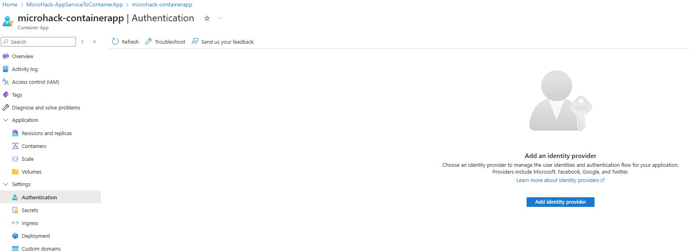
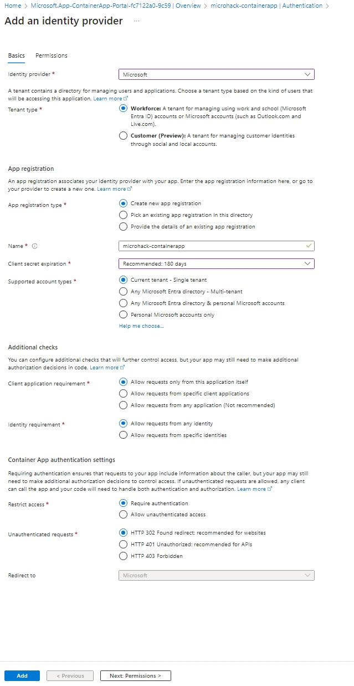
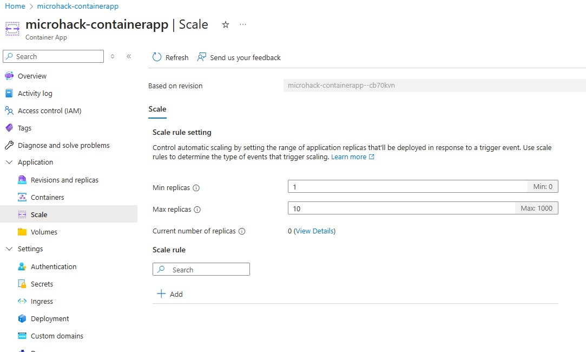
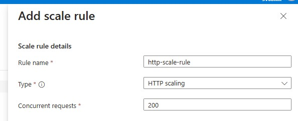
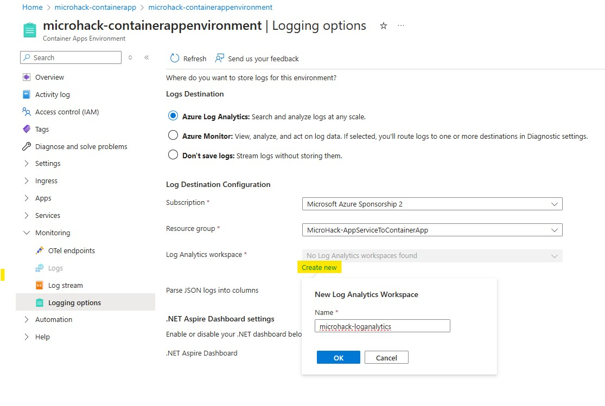

# Walkthrough Challenge 4 - Make the Container App Production Ready

Duration: 60 minutes

## Prerequisites

Please make sure that you have successfully completed [Challenge 3](../challenge-3/solution.md) before continuing with this challenge.

## **Task 1: Enable Authentication with Azure Entra ID**

You can quickly integrate an Azure Container App with Azure Entra ID (or any other OIDC identity provider like GitHub, Facebook, Google, etc.) without changing the implementation of the app. Simply go to the *Authentication* tab of the Container App and hit *Add identity provider*:

Select *Microsoft* as the ID provider:

Select `Workforce` as the tenant type.

Select `Create new app registration`, name it something like "microhack-containerapp" and select `Current tenant - Single tenant` to create an App Registration in your Azure Entra ID tenant.

Set the *Client secret expiration* to 180 days.

Mark `Require authentication` to make sure only authenticated users can access the app. If the authentication fails, you can choose to which error page you want to redirect unauthenticated users. Leave the rest as is and hit *Add* to activate the authentication (this may take up to a minute in the background):

This will deploy a sidecar container to your app. Before a user can access the container that hosts your web app, the user has to authenticate against Azure Entra ID. You can open the app again to check if it works. Since you are probably already logged in with your Azure account, you might be authenticated automatically. If you open the app URL in private mode, you will see that authentication is required and you will need to log in with your Azure account.

## **Task 2: Configure Autoscaling**

A single Container App instance will not be able to endlessly serve an increasing number of users.

It makes sense to limit the number of connections of a single instance and then scale in and out. You can quickly configure automatic scaling.

Open the *Scale* tab in the *Application* section. It makes sense to always have at least one instance of the Container App running. You can let it scale to zero, which might save some cost, but starting an instance might take some time which can be inconvenient for users. Set the `Min replicas` to 1:

Next, click on *+ Add* under *Scale rule*. Give the rule a name, e.g., "http-scale-rule". You can configure scale rules based on the number of concurrent HTTP requests per instance or you can use KEDA scalers (this is an extension from the Kubernetes world for more fine-grained, event-based scaling). Set the *Type* to HTTP scaling, then set the *Concurrent requests* to 200. Click *Add* and then *Create* to finish.

As you can see, you can simply configure the scaling of your app without managing infrastructure, configuring load balancing, or setting up orchestration - you just need a few clicks and the work is done for you in the background!

## **Task 3: Enable Monitoring and Logging**

In production scenarios, you want to know what is happening in your systems. Observability is important. You can simply enable monitoring and logging for your Azure Container Apps.

Go to the *Logging options* in the *Monitoring* section of the Container Apps Environment in the portal and activate the `Azure Log Analytics` logging. The logs will be stored in a Log Analytics workspace which must first be created. Choose the resource group of the MicroHack, hit *Create new* and enter a name, then hit *Save* at the bottom:

You may need to wait some time until the logs start showing up in the Log Analytics workspace. You can play around with queries and check what information is available in the logs. Open the *Logs* tab of the Container App and create a new query. For example, you can check all the successful requests with this query (make sure to replace the `ContainerAppName` with the name of your Container App):

    ContainerAppConsoleLogs
    | where ContainerAppName == "microhack-containerapp"
    | where Log contains "Request finished"

## **Task 4: Configure encryption**

Encrypting traffic is crucial to secure the communication from the clients to the Container App. You will require a certificate that must be signed by a trusted certificate authority, then you need to configure your application to use the certificate (both in the application code and in the Dockerfile!), then you also need to store the certificate somewhere (e.g. in a vault) where it can be accessed securely. And lastly, you need to change the application to redirect HTTP to HTTPS.

You have finally reached the most difficult task!

The good news is that Azure Container Apps takes care of all of this for you. When you set up the ingress for your Container App, you did not check the option to allow insecure connections, remember? ;) Container Apps automatically ensures that all traffic to and from your application is encrypted.

By default, Container Apps use HTTPS and provide a managed certificate, so there’s no need to obtain and manage your own certificate. Additionally, any unencrypted HTTP traffic is automatically redirected to HTTPS, ensuring that all communications are secure — without you needing to do anything extra!

Remember, you can create custom domains and manage certificates in Azure as well!

## **End of Challenge 4**

You have successfully completed challenge 4! 🚀🚀🚀

 **[Home](../../README.md)** - [Next Challenge Solution](../challenge-5/solution.md)
