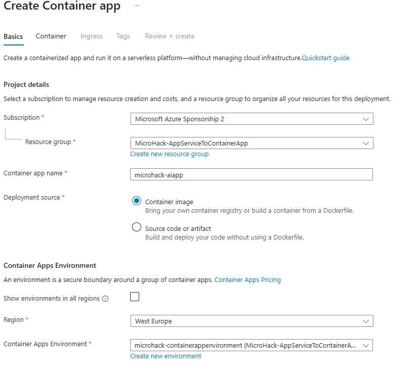
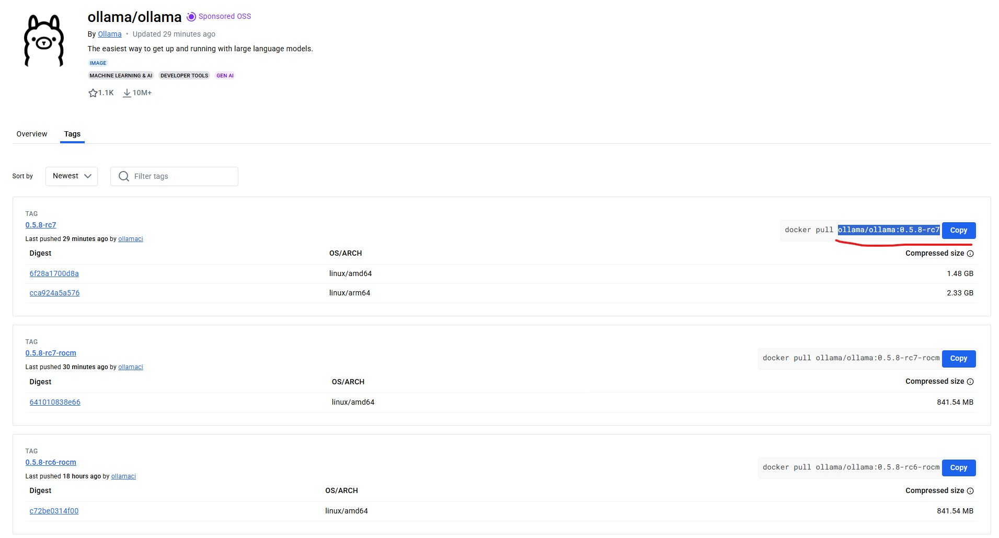
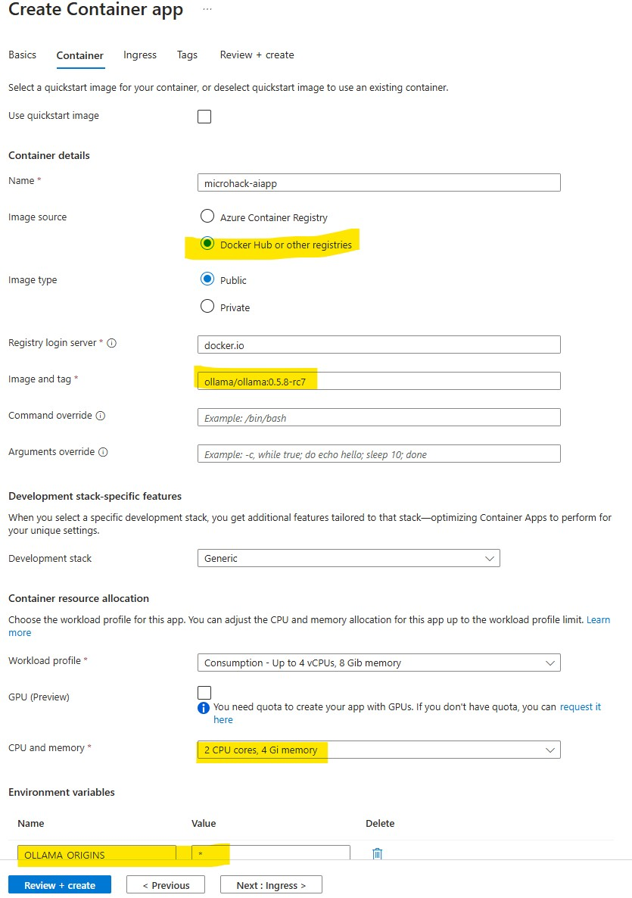
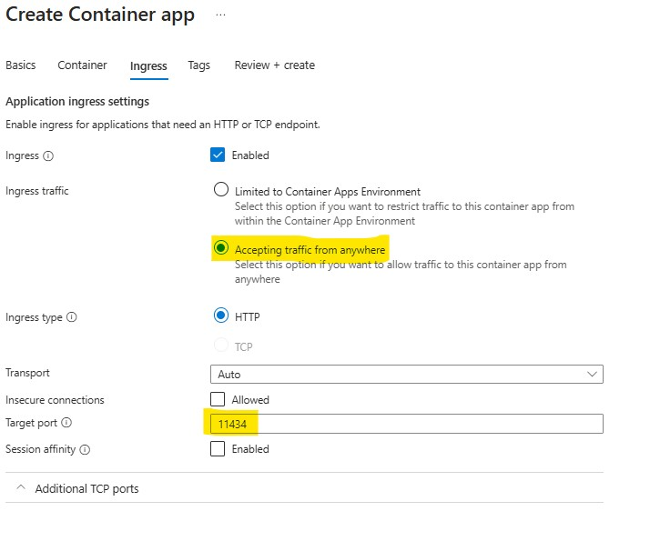

# Walkthrough Challenge 5 - Host Your Own AI Models

Duration: 60 minutes

## Prerequisites

Please make sure that you have successfully completed [Challenge 4](../challenge-4/solution.md) before continuing with this challenge.

## **Task 1: Host the Ollama container image**

The web interface is already prepared; you can check it in the *Index.cshtml* file in the *Pages/Shared* folder in the repository. It takes the input from the text field and then calls an API where the AI model is hosted. Let's begin with hosting the model.

In the Azure Portal, create a new Container App. You can call it `microhack-aiapp`. Make sure that the Container App Environment is the one you created in challenge 2 where the other app is already running.



In the *Container* tab, you need to choose `Docker Hub or other registries`. Docker Hub is a public container registry where all sorts of container images are publicly available so you can directly deploy them (make sure you are allowed to regarding the license though). In this MicroHack, we are going to use the open-source Llama models since they are free to use and efficient. You could also use OpenAI or other models of course. Luckily, there is a container image prepared on Docker Hub already. We are going to use something from the `ollama` repository, namely the `ollama` image with the tag `0.5.8-rc7` -> `ollama/ollama:0.5.8-rc7`. You can find details here: https://hub.docker.com/r/ollama/ollama/tags



Set the *CPU and memory* to `2 CPU cores, 4 Gi memory` to give the model some more resources. Lastly, the container image is configured to prevent CORS. You can change configurations by adding environment variables; add one named `OLLAMA_ORIGINS` and add a `*` as value to allow you to call the API from your *microhack-containerapp*.



On the *Ingress* tab, enable the ingress and set it to `Accept traffic from anywhere`, set the *Target port* to `11434`.



## **Task 2: Start the Llama 3.2 model**

Now that the Container App is running, you still need to activate the llama 3.2 model. Open the Azure Shell: https://portal.azure.com/#cloudshell/

You need to connect to the container to run commands inside the container itself. You can use that to modify the applications running in the container or to check logs. To connect to the container, you can use the `az containerapp exec` command. Replace the name of the Container App or Resource Group with the ones you used; the command must be `/bin/sh` to run commands in the container:

`az containerapp exec --name microhack-aiapp --resource-group MicroHack-AppServiceToContainerApp --command "/bin/sh"`

You should see *INFO: Connection to the container 'microhack-aiapp'...*

After that, you can load and run the llama 3.2 model by running this command: `ollama run llama3.2`

After the model is loaded, you can already chat with it:


The model is now up and running. Every time the container shuts down, you will need to re-run these commands. To prevent the app from shutting down, set the minimum number of replicas to 1 (as you did in challenge 4 with the other app).

## **Task 3: Connect the Web App with the API**

You will need the *Application Url* from the *microhack-aiapp*; copy it to the clipboard.


Switch to the GitHub Actions workflow that deploys to the Container App. You only need to append a single line at the end. In the *Deploy to Container App* task, add this line:

```
environmentVariables: |
          API_URL=<your-aiapp-url>
```

You can run the workflow to deploy the new version. It will pick up the API URL and use that to connect to the *microhack-aiapp* to call the model. After it has been successfully deployed, you should be able to send prompts from your web app (it might be a little slow, though).

As you can see, you can easily host applications or AI models and let them work together. Container Apps allow you to focus on your applications and functionality, while infrastructure, networking, encryption, etc. are configured automatically for you.

## **End of Challenge 5**

You have successfully completed challenge 5! 🚀🚀🚀

 **[Home](../../README.md)**
